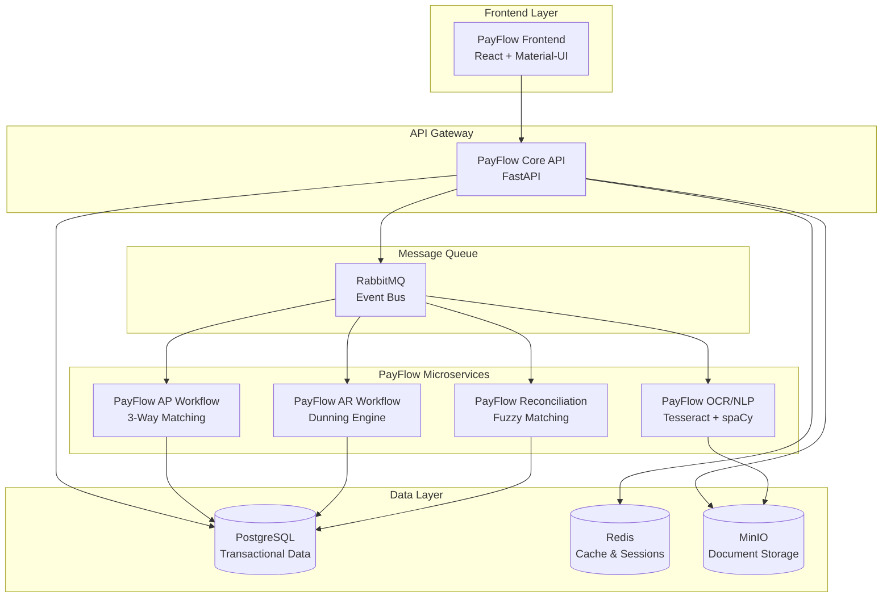
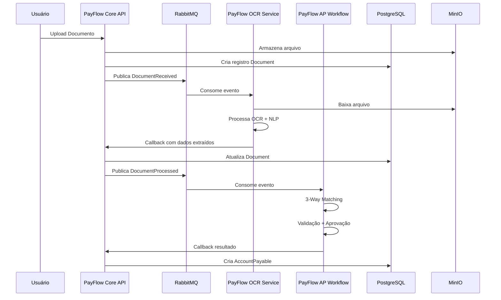
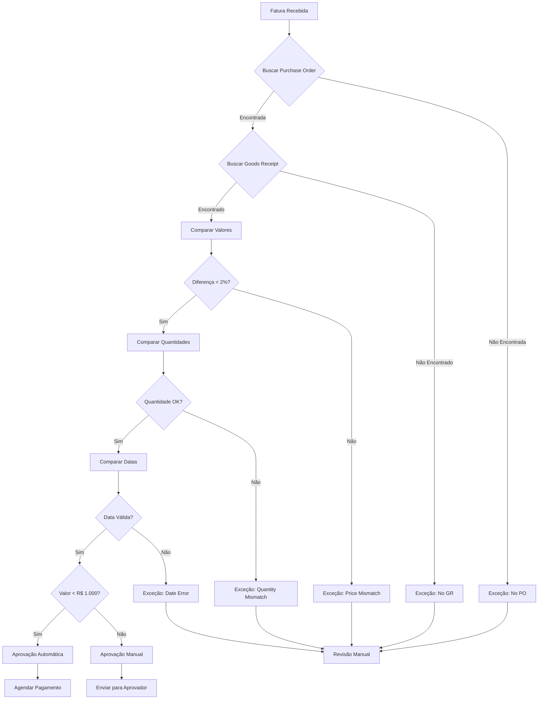
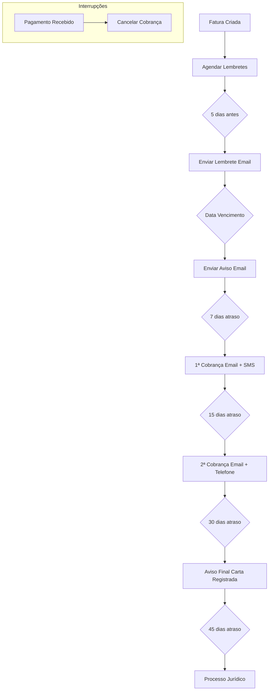
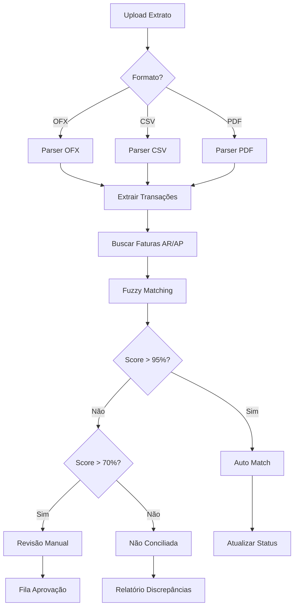

# 💰 PayFlow - Sistema de Automação Financeira

## 🎯 Sobre o Projeto

**PayFlow** é um **sistema completo de automação financeira empresarial** que implementa soluções avançadas para gestão de contas a pagar e receber. O objetivo é showcasing de habilidades avançadas em:
   
- **🤖 Inteligência Artificial** (OCR + NLP)
- **🏗️ Arquitetura de Microsserviços** 
- **⚡ Processamento Assíncrono de Dados**
- **🌐 Sistemas Distribuídos**
- **🔗 Integração de APIs**

O **PayFlow** automatiza o ciclo financeiro empresarial completo, desde a recepção de documentos até a execução de pagamentos e conciliação bancária.

## 🚀 Funcionalidades Implementadas

### 📄 Processamento de Documentos
- **Upload real** de arquivos (PDF, JPG, PNG) para MinIO
- **OCR automático** com Tesseract para extração de texto
- **NLP com spaCy** para extração de entidades estruturadas
- **Pré-processamento** de imagens com OpenCV

### ⚖️ Contas a Pagar (AP)
- **3-Way Matching** automático (Purchase Order + Receipt + Invoice)
- **Motor de aprovação** com regras configuráveis por valor
- **Detecção de exceções** e tratamento automático
- **Fluxo de aprovação** hierárquico
- **Agendamento** de pagamentos

### 💰 Contas a Receber (AR)
- **Criação automática** de faturas
- **Régua de cobrança** (Dunning) automatizada
- **Múltiplos canais** de notificação (Email, SMS, Telefone)
- **Controle de inadimplência**
- **Geração de boletos** e PIX (simulado)

### 🏦 Conciliação Bancária
- **Parser de extratos** (OFX, CSV, PDF)
- **Fuzzy matching** com algoritmos avançados
- **Matching automático** por valor, data e descrição
- **Detecção de discrepâncias**
- **Conciliação** de recebimentos e pagamentos

## 🏗️ Arquitetura do PayFlow



## 🔄 Fluxo de Processamento de Documentos do PayFlow



## ⚖️ Fluxo de 3-Way Matching do PayFlow



## 💰 Fluxo de Cobrança (Dunning) do PayFlow



## 🏦 Fluxo de Conciliação Bancária do PayFlow



## 🛠️ Stack Tecnológica

### Backend
- **🐍 Python 3.11** com FastAPI
- **🐘 PostgreSQL** para dados transacionais
- **🔴 Redis** para cache e sessões
- **🐰 RabbitMQ** para mensageria assíncrona
- **📦 MinIO** para armazenamento S3-compatible

### IA/ML
- **👁️ Tesseract OCR** para extração de texto
- **🧠 spaCy** para processamento de linguagem natural
- **🖼️ OpenCV** para pré-processamento de imagens
- **🔍 FuzzyWuzzy** para matching de strings

### Frontend
- **⚛️ React 18** com TypeScript
- **🎨 Material-UI** para componentes
- **📊 Recharts** para visualizações
- **🔄 React Query** para gerenciamento de estado

### DevOps
- **🐳 Docker** + **Docker Compose**
- **🔧 Makefile** para automação
- **📝 Swagger/OpenAPI** para documentação

## 🚀 Como Executar o PayFlow

### Pré-requisitos
```bash
# Instalar dependências
docker --version
docker-compose --version
```

### Execução Completa
```bash
# Clone o repositório
git clone <repository-url>
cd payflow

# Execute todos os serviços
docker-compose up -d

# Verificar status
docker-compose ps
```

### Execução Local Rápida (PayFlow Core API apenas)
```bash
# Para desenvolvimento rápido
python3 run_local.py
```

## 🌐 Endpoints Disponíveis

### Serviços Principais do PayFlow
- **PayFlow Core API**: `http://localhost:8000`
- **Documentação**: `http://localhost:8000/docs`
- **Health Check**: `http://localhost:8000/health`

### Interfaces de Administração do PayFlow
- **RabbitMQ Management**: `http://localhost:15672` (credenciais no .env)
- **MinIO Console**: `http://localhost:9001` (credenciais no .env)

### Portas dos Serviços PayFlow
| Serviço | Porta | Descrição |
|---------|-------|-----------|
| PayFlow Core API | 8000 | API principal |
| PayFlow AP Workflow | 8002 | Contas a Pagar |
| PayFlow AR Workflow | 8003 | Contas a Receber |
| PayFlow Reconciliation | 8004 | Conciliação |
| PostgreSQL | 5433 | Banco de dados |
| Redis | 6380 | Cache |
| RabbitMQ | 5672/15672 | Message Queue |
| MinIO | 9000/9001 | Storage |

## 📋 Funcionalidades por Módulo

### 🤖 PayFlow OCR/NLP Service
- ✅ Processamento real com Tesseract
- ✅ Extração de entidades com spaCy
- ✅ Pré-processamento de imagens
- ✅ Suporte a PDF, JPG, PNG
- ✅ Callback de resultados

### ⚖️ PayFlow AP Workflow (3-Way Matching)
- ✅ Comparação automática PO + Receipt + Invoice
- ✅ Validação de preços (tolerância 2%)
- ✅ Validação de quantidades (tolerância 2%)
- ✅ Validação de datas (tolerância 7 dias)
- ✅ Motor de aprovação por valor
- ✅ Detecção e tratamento de exceções
- ✅ Agendamento automático de pagamentos

### 💰 PayFlow AR Workflow (Dunning)
- ✅ Criação automática de faturas
- ✅ Régua de cobrança configurável
- ✅ Notificações multi-canal (Email, SMS, Telefone)
- ✅ Controle de inadimplência
- ✅ Cancelamento automático ao receber pagamento

### 🏦 PayFlow Reconciliation Service
- ✅ Parser de extratos OFX, CSV, PDF
- ✅ Algoritmos de fuzzy matching
- ✅ Matching por valor, data e descrição
- ✅ Score de confiança configurável
- ✅ Detecção de discrepâncias
- ✅ Relatórios de conciliação

## 🧪 Como Testar o PayFlow

### Upload de Documento
```bash
curl -X POST "http://localhost:8000/api/v1/documents/upload" \
  -H "Content-Type: multipart/form-data" \
  -F "file=@invoice.pdf" \
  -F "document_type=invoice"
```

### Verificar Processamento
```bash
curl "http://localhost:8000/api/v1/documents"
```

### Testar 3-Way Matching do PayFlow
```bash
curl -X POST "http://localhost:8002/process-invoice" \
  -H "Content-Type: application/json" \
  -d '{"id": "inv-001", "supplier_id": "sup-001", "total_amount": 1500.00}'
```

### Testar Conciliação do PayFlow
```bash
curl -X POST "http://localhost:8004/upload-statement" \
  -F "file=@extrato.ofx"
```

## 📊 Configurações Implementadas

### Tolerâncias do 3-Way Matching do PayFlow
- **Diferença de Preço**: Até 2% aceita automaticamente
- **Diferença de Quantidade**: Até 2% aceita automaticamente
- **Diferença de Data**: Até 7 dias aceita automaticamente

### Regras de Aprovação do PayFlow
- **Valores < R$ 1.000**: Aprovação automática após matching
- **Valores ≥ R$ 1.000**: Requer aprovação manual

## 🎯 Diferenciais Técnicos do PayFlow

1. **🤖 IA Avançada**: Pipeline completa OCR + NLP
2. **📈 Escalabilidade**: Microsserviços horizontalmente escaláveis
3. **🔒 Segurança**: Controle de acesso e validação robusta
4. **⚙️ Flexibilidade**: Regras configuráveis por empresa
5. **🔗 Integração**: APIs RESTful para integração com ERPs

## 📈 Implementações Técnicas do PayFlow

- ✅ **Pipeline OCR**: Tesseract + OpenCV para pré-processamento
- ✅ **NLP**: spaCy para extração de entidades estruturadas
- ✅ **Arquitetura Distribuída**: 5 microsserviços independentes
- ✅ **Workers Assíncronos**: RabbitMQ para processamento paralelo
- ✅ **Event-Driven**: Comunicação via eventos entre serviços

## 🎓 Competências Demonstradas

- **🤖 Machine Learning**: OCR, NLP, Fuzzy Matching
- **🏗️ Arquitetura**: Microsserviços, Event-Driven, APIs
- **🐳 DevOps**: Docker, Containerização, Orquestração
- **🔗 Integração**: Message Queues, Storage, Databases
- **🔒 Segurança**: Autenticação, Validação, Controle de Acesso
- **📊 Dados**: PostgreSQL, Redis, Processamento Assíncrono

## 📝 Estrutura do Projeto PayFlow

```
payflow/
├── services/
│   ├── core-api/          # PayFlow Core API
│   ├── ocr-nlp/           # PayFlow OCR/NLP Service
│   ├── ap-workflow/       # PayFlow AP Workflow
│   ├── ar-workflow/       # PayFlow AR Workflow
│   └── reconciliation/    # PayFlow Reconciliation Service
├── frontend/              # PayFlow Frontend
├── infrastructure/        # Scripts SQL
├── docker-compose.yml     # Orquestração
└── README.md             # Documentação
```

---

*PayFlow - Sistema de Automação Financeira desenvolvido para demonstração de habilidades técnicas avançadas em desenvolvimento full-stack, IA e arquitetura de sistemas distribuídos.*
